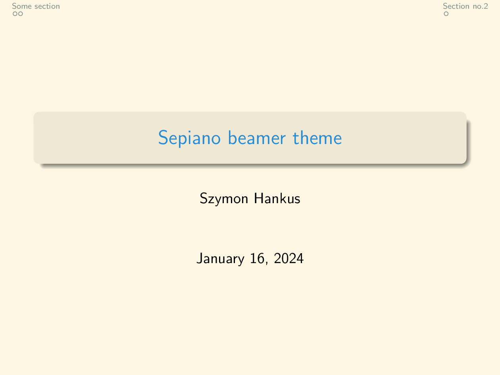
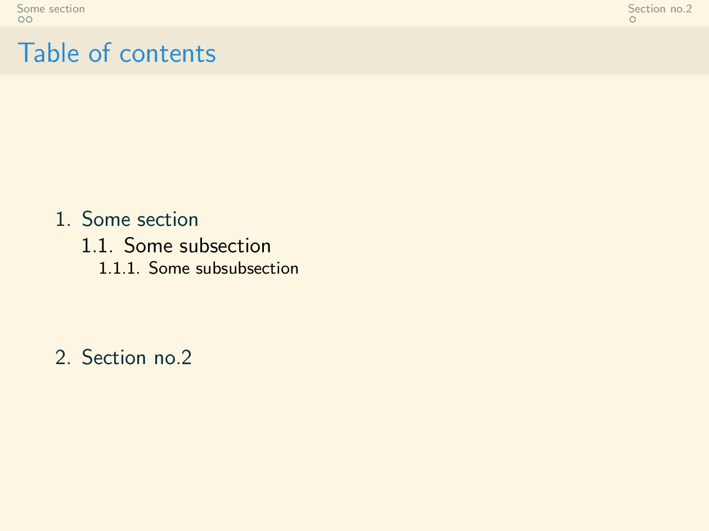
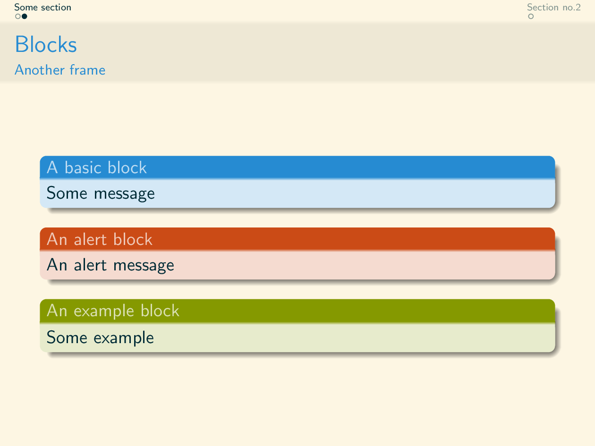
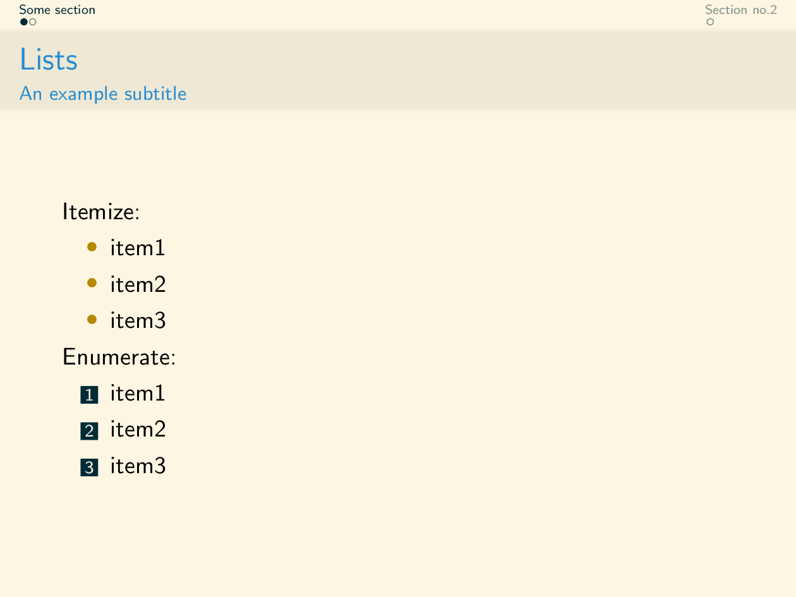

# Sepiano
> Based on the solarized light colorscheme

A beamer theme that I created as an assignment for a LaTeX university course.
It relies on [solarized](https://ethanschoonover.com/solarized/).

Feel free to use it :)

## Examples
The following images reflect subsequent pages of the [example pdf file](example.pdf), that one can obtain by compiling the [tex file](example.tex).

### Title page

### Table of contents

### Table of contents

### Blocks

### Enumerate and Itemize

### Column layout

### A final 'thank you' slide
